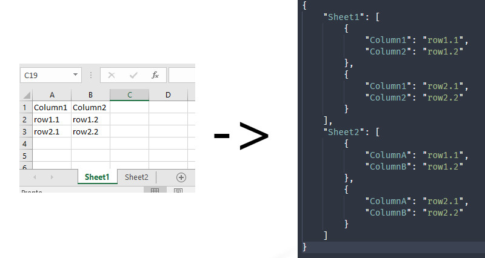

# from_excel_to_json
A simple python script that enables a simple yet usefule excel-to-json conversion



## Requirements

* Python 3.6+

## Installation

```
pip install -R requirements
```

## Usage

```
python ./from_excel_to_json.py ./input_excel.xlsx
```

This command will output in the same folder of the Excel file a JSON representation of that file.
